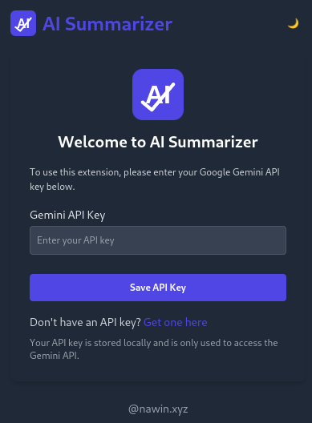
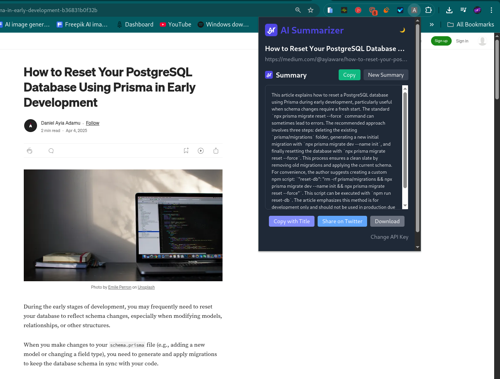

# AI Summarizer Chrome Extension


A Chrome extension that uses the Gemini AI API to generate concise summaries of web pages. Built with React, TypeScript, and Tailwind CSS.

<!--Line-->


## Features

- 📝 Generate summaries of any web page with one click
- 🌙 Dark mode support
- 📋 Copy summaries to clipboard
- 💾 Download summaries as text files
- 🔄 Share summaries on social media
- 🔒 Secure API key storage (locally only)
- 🎨 Clean, responsive UI

<!--Line-->


## Screenshots



## Prerequisites

Before you begin, ensure you have the following installed:
- [Node.js](https://nodejs.org/) (v14 or later)
- [npm](https://www.npmjs.com/) (v6 or later)
- Google Chrome browser


<!--Line-->


## Getting Started

### 1. Clone the repository

```bash
git clone https://github.com/yourusername/ai-summarizer-extension.git
cd ai-summarizer-extension
```

### 2. Install dependencies

```bash
npm install
```

### 3. Get a Gemini API Key

You'll need a Google Gemini API key:
1. Go to [Google AI Studio](https://ai.google.dev/)
2. Create or sign in to your account
3. Navigate to the [API keys section](https://ai.google.dev/tutorials/get_api_key)
4. Create a new API key and copy it

### 4. Build the extension

```bash
npm run build
```

This creates a `dist` directory with the extension files.

### 5. Load the extension in Chrome

1. Open Chrome and navigate to `chrome://extensions/`
2. Enable "Developer mode" (toggle in the top-right corner)
3. Click "Load unpacked" and select the `dist` directory
4. The extension should now appear in your extensions list

<!--Line-->


## Usage

1. Click the AI Summarizer icon in your Chrome toolbar
2. If it's your first time, enter your Gemini API key
3. Click "Summarize Page" to generate a summary of the current webpage
4. Use the provided buttons to copy, download, or share the summary

<!--Line-->


## Development

### Available Scripts

- `npm run start` - Start development server
- `npm run build` - Build for production
- `npm run watch` - Watch for changes during development
- `npm run generate-icons` - Generate extension icons


<!--Line-->


### Project Structure

```
src/
├── assets/           # Icons and assets
├── background/       # Background scripts
├── components/       # React components
├── contentScript/    # Content scripts that run on web pages
├── popup/            # Popup UI
└── services/         # API services
```

<!--Line-->


## License

[MIT](LICENSE)


<!--Line-->


## Acknowledgements

- [Google Gemini API](https://ai.google.dev/)
- [React](https://reactjs.org/)
- [TypeScript](https://www.typescriptlang.org/)
- [Tailwind CSS](https://tailwindcss.com/)


<!--Line-->


## Contact

Your Name - [@nawin](https://x.com/nawinscript) - msg.nawin@gmail.com

Project Link: [https://github.com/nawinsharma/TL_DR-ai](https://github.com/nawinsharma/TL_DR-ai)
